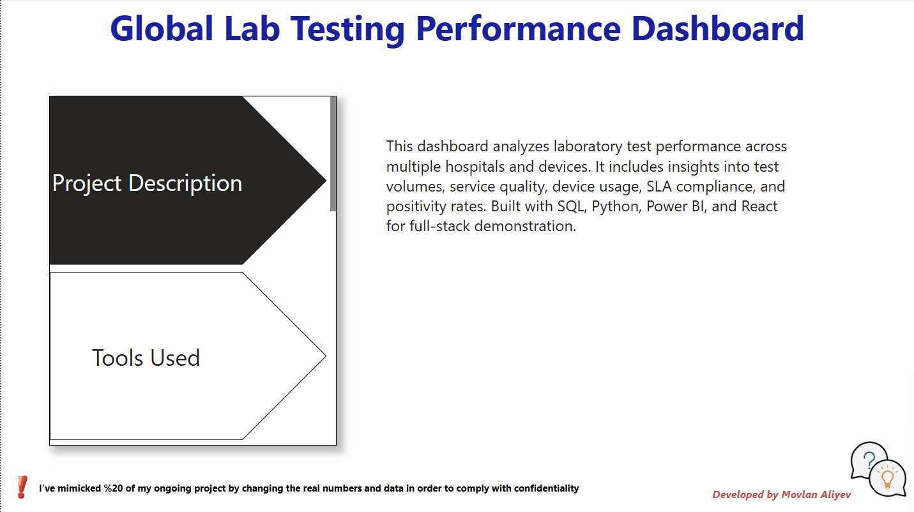
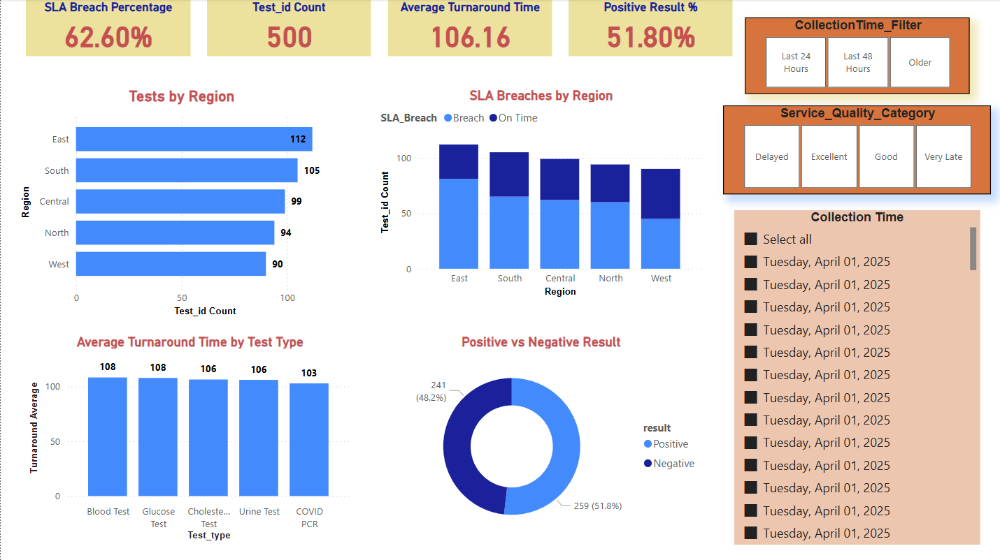

# 🌐 Global Lab Test Dashboard

End-to-end healthcare analytics platform using **Power BI, React, SQL, Azure, and APIs**.  
Tracks lab test performance, SLA breaches, and hospital risk levels with real-time insights.

---

## 🚀 Tech Stack

| Layer         | Technology Used                     |
|---------------|--------------------------------------|
| Frontend      | React.js, Bootstrap, Chart.js        |
| Backend       | JSON Server (API Mock), Node.js      |
| Analytics     | Power BI                             |
| Data Storage  | Azure SQL Database                   |
| Data Pipeline | Azure Data Factory + Synapse + DBX   |
| Language      | SQL, Python, JavaScript              |

---

## 📸 Dashboard Preview (Power BI)

> 📊 KPI Cards • Line Chart • Pie Chart • Matrix Heatmap • Risk Scores • Dynamic Filters

### 🔍 Introduction Preview


### 🧩 Test-Volume-Analysis


### 🔎 Smart Insights


---

## 🧪 Features

- Interactive filtering by hospital, test type, and date
- SLA breach trend analysis (Line & Bar charts)
- Smart KPI cards with risk classification 🔥
- Power BI integration with custom DAX
- End-to-end Azure data pipeline simulation
- Professional GitHub structure & docs

---

## 🧠 Architecture

```
[ React UI ] → [ Axios API ] → [ JSON Server ]  
                     ↓  
        [ Azure SQL Database ]  
                     ↓  
[ ADF → Synapse Analytics → Power BI ]
```

---

## 📂 Folder Structure

```
GlobalLabTestDashboard/
├── data/                 → Raw CSV data
├── sql/                  → Complex queries with CTEs
├── python/               → Data preprocessing script
├── powerbi/              → PBIX dashboard file
├── web-dashboard/        → Full React frontend
├── images/               → Power BI screenshot
├── db.json               → API source for frontend
├── README.md             → 📖 This file
```

---

## 🧑‍💻 Author

**Movlan Aliyev**  
📍 Boston, MA  
📧 robert.movlan@outlook.com
🔗 [LinkedIn](https://www.linkedin.com/in/movlan-aliyev/) | [Portfolio](#)

---

## 🌍 License

MIT — use this project freely for learning or inspiration.