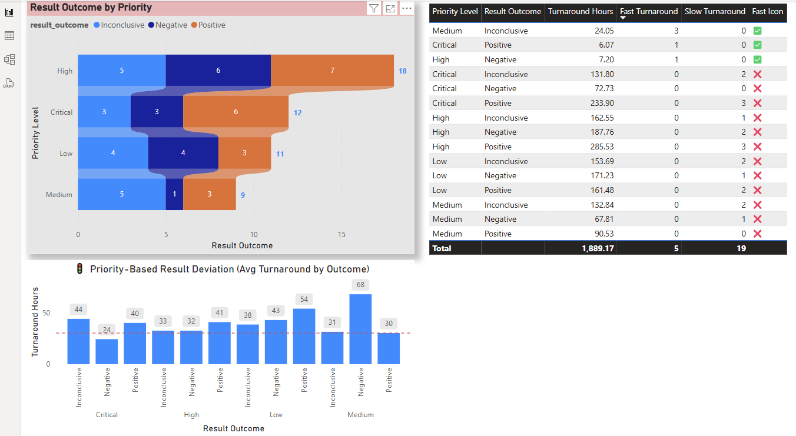
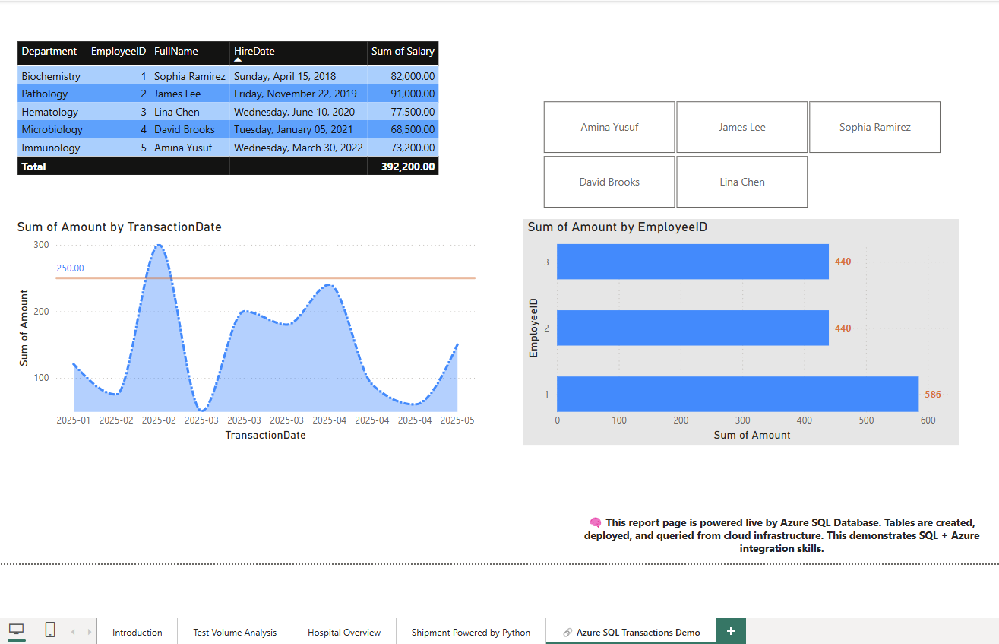
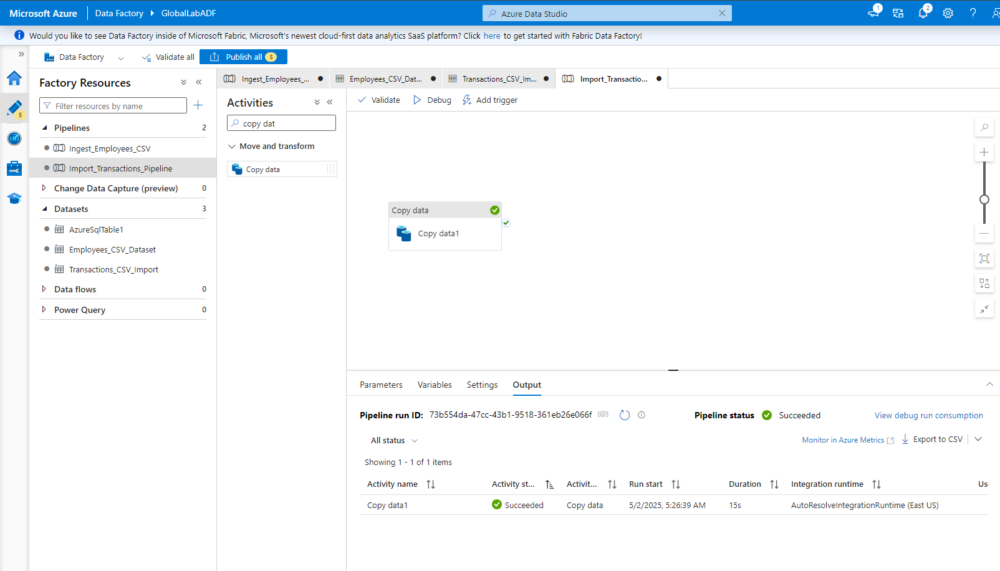
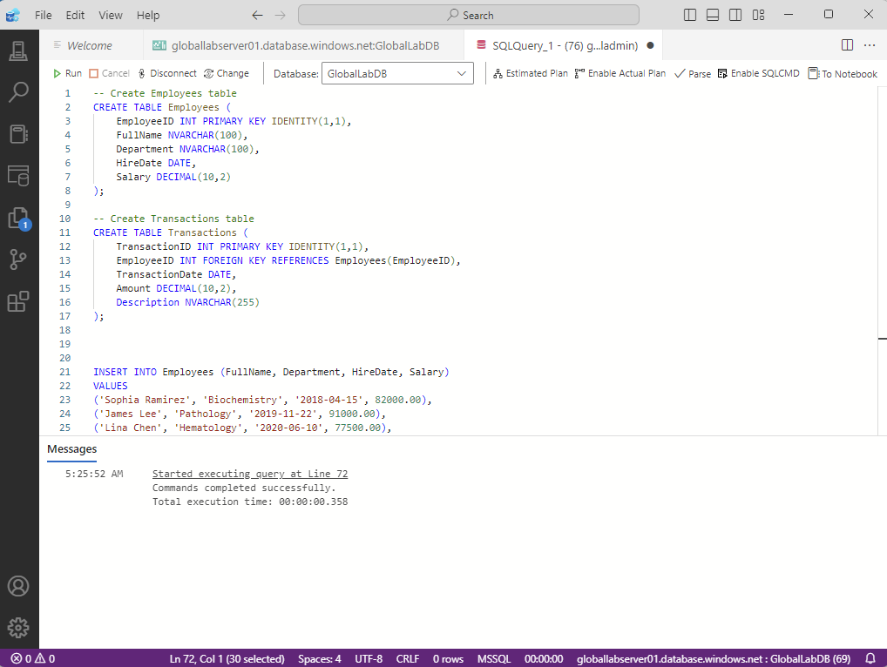

# 🌐 Global Lab Test Dashboard

End-to-end healthcare analytics platform using **Power BI, React, SQL, Azure, and APIs**.  
Tracks lab test performance, SLA breaches, shipment risk levels, and hospital KPIs with real-time insights.

---

## 🚀 Tech Stack

| Layer         | Technology Used                     |
|---------------|--------------------------------------|
| Frontend      | React.js, Bootstrap, Chart.js        |
| Backend       | JSON Server (API Mock), Node.js      |
| Analytics     | Power BI                             |
| Data Storage  | Azure SQL Database                   |
| Data Pipeline | Azure Data Factory + Synapse + DBX   |
| Language      | SQL, Python, JavaScript              |
| Hosting       | Firebase (Live Deployment)           |

---

## 📸 Dashboard Preview (Power BI)

> 📊 KPI Cards • Line Chart • Pie Chart • Matrix Heatmap • Risk Scores • Dynamic Filters

### 🔍 Introduction Preview  

### 🧩 Test-Volume-Analysis  

### 🔎 Smart Insights  

---

## 🚚 Shipment Delay Risk Dashboard (React + JSON)

This advanced dashboard module analyzes predicted shipment delays using:

- 📦 `shipment_transformed.json` – processed data with `predicted_delay_risk`, `actual_delivery`, `expected_delivery`, and more.
- 🎯 **Color-coded risk bars**: green (low), orange (medium), red (high)
- 🧠 Tooltip insights showing carrier, region, delay status, and delivery dates
- 🔁 Fully interactive and embedded into the main dashboard layout

> Implemented as a React component using Chart.js.

### 📸 Shipment Dashboard Preview  

---

## 🔗 Live Hosted Dashboard

👉 [View Live Dashboard](https://global-lab-test-dashboard.web.app)

---

## 🧪 Features

- Interactive filtering by hospital, test type, and date
- SLA breach trend analysis (Line & Bar charts)
- Smart KPI cards with risk classification 🔥
- Shipment delay risk prediction via color-coded bar charts
- Power BI integration with custom DAX
- End-to-end Azure data pipeline simulation
- Professional GitHub structure & documentation

---

## 🧠 Architecture

[ React UI ] → [ Axios API ] → [ JSON Server ]
↓
[ Azure SQL Database ]
↓
[ ADF → Synapse Analytics → Power BI ]

markdown
Copy
Edit

---

## ☁️ Azure Data Integration Extension

This project was extended to demonstrate **cloud-based data pipeline skills using Azure**, including:

### 💽 Azure SQL Database (GlobalLabDB)
- `Employees` table with fields like `FullName`, `HireDate`, `Salary`
- `Transactions` table with foreign key to `Employees`, and fields like `TransactionDate`, `Amount`, `Description`
- Tables created using SQL scripts via **Azure Data Studio**

### 🔄 Azure Data Factory (ADF)
- ✅ Ingested two CSVs (Employees, Transactions) stored in **Azure Blob Storage**
- 🛠️ Created pipelines to transform and load data into Azure SQL DB
- 💡 Error-handling and primary key enforcement tested via multiple iterations
- 📁 Blob container path: `input-data/transactions1.csv`

### 📊 Power BI Connected to Azure SQL
- Live connection to Azure SQL Database
- New **Power BI page** shows:
  - Line chart of `Transaction Amounts` by `Transaction Date`
  - Employee-to-Transaction mapping
  - Cloud-symbol watermark indicating Azure integration

### 🔗 Azure SQL Transactions Demo Page
> 📈 Interactive line chart of transaction amounts by date  

### 📁 Visual Evidence (Azure Tools)
- 🧾 Azure Data Factory: Pipeline success  
  

- 💻 Azure Data Studio: SQL script executed  
  

---

## ☁️ Cloud Integration Assets

All code and pipeline templates used in the Azure pipeline process are included here:

📁 `cloud-integration/`
- `adf_pipeline.json` – Azure Data Factory export pipeline (JSON)
- `databricks_notebook.py` – Sample Databricks notebook (paused for now)
- `employees.csv`, `transactions.csv` – Sample data used in Azure uploads
- `synapse_query.sql` – Azure Synapse SQL query example

These files represent end-to-end integration from storage to database to analytics.

---

## 📂 Folder Structure

GlobalLabTestDashboard/
├── data/ → Raw shipment & lab data (CSV, JSON)
├── sql/ → Complex queries with CTEs
├── python/ → Shipment preprocessing & analysis
├── powerbi/ → PBIX dashboard file
├── web-dashboard/ → Full React frontend
│ ├── public/
│ │ ├── data/
│ │ │ ├── shipment_delay.json
│ │ │ └── shipment_transformed.json
│ ├── src/
│ │ ├── components/
│ │ │ └── ShipmentDelayHeatmap.jsx
│ │ └── App.js
├── images/ → Power BI & Azure screenshots
│ ├── azure_adf_success.png
│ ├── azure_sql_execution.png
│ └── azure-sql-transactions-page.png
├── db.json → Mock API data source
├── README.md → 📖 This file

yaml
Copy
Edit

---

## 🧑‍💻 Author

**Movlan Aliyev**  
📍 Boston, MA  
📧 robert.movlan@outlook.com  
🔗 [LinkedIn](https://www.linkedin.com/in/movlan-aliyev/) | [Portfolio](#)

---

## 🚀 Deployment

The app is deployed via Firebase Hosting:  
👉 [https://global-lab-test-dashboard.web.app](https://global-lab-test-dashboard.web.app)

To redeploy the latest version, see the full guide:  
📄 [HOW_TO_DEPLOY.md](HOW_TO_DEPLOY.md)

---

## 🌍 License

MIT — use this project freely for learning or inspiration.