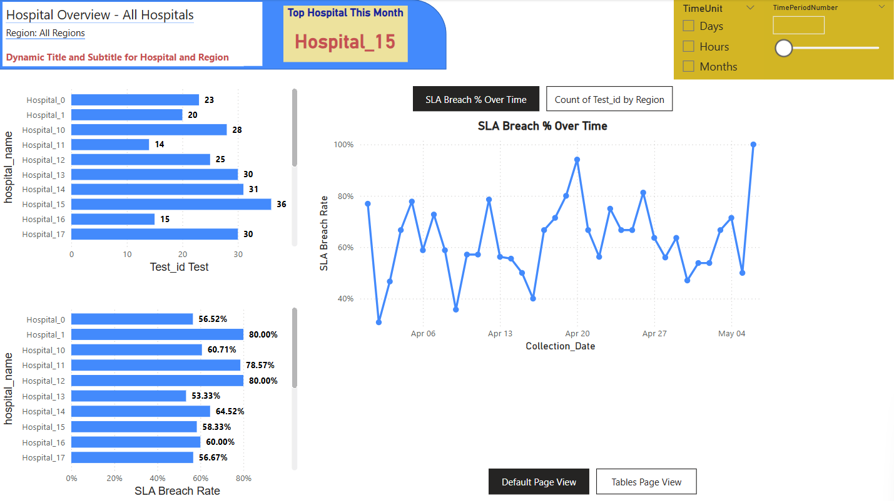

# 🌐 Global Lab Test Dashboard

End-to-end healthcare analytics platform using **Power BI, React, SQL, Azure, and APIs**.  
Tracks lab test performance, SLA breaches, shipment risk levels, and hospital KPIs with real-time insights.

---

## 🚀 Tech Stack

| Layer         | Technology Used                     |
|---------------|--------------------------------------|
| Frontend      | React.js, Bootstrap, Chart.js        |
| Backend       | JSON Server (API Mock), Node.js      |
| Analytics     | Power BI                             |
| Data Storage  | Azure SQL Database                   |
| Data Pipeline | Azure Data Factory + Synapse + DBX   |
| Language      | SQL, Python, JavaScript              |
| Hosting       | Firebase (Live Deployment)           |

---

## 📸 Dashboard Preview (Power BI)

> 📊 KPI Cards • Line Chart • Pie Chart • Matrix Heatmap • Risk Scores • Dynamic Filters

### 🔍 Introduction Preview  

### 🧩 Test-Volume-Analysis  

### 🔎 Smart Insights  

---

## 🚚 Shipment Delay Risk Dashboard (React + JSON)

This advanced dashboard module analyzes predicted shipment delays using:

- 📦 `shipment_transformed.json` – processed data with `predicted_delay_risk`, `actual_delivery`, `expected_delivery`, and more.
- 🎯 **Color-coded risk bars**: green (low), orange (medium), red (high)
- 🧠 Tooltip insights showing carrier, region, delay status, and delivery dates
- 🔁 Fully interactive and embedded into the main dashboard layout

> Implemented as a React component using Chart.js.

### 📸 Shipment Dashboard Preview  

---

## 🔗 Live Hosted Dashboard

👉 [View Live Dashboard](https://global-lab-test-dashboard.web.app)

---

## 🧪 Features

- Interactive filtering by hospital, test type, and date
- SLA breach trend analysis (Line & Bar charts)
- Smart KPI cards with risk classification 🔥
- Shipment delay risk prediction via color-coded bar charts
- Power BI integration with custom DAX
- End-to-end Azure data pipeline simulation
- Professional GitHub structure & documentation

---

## 🧠 Architecture

[ React UI ] → [ Axios API ] → [ JSON Server ]
↓
[ Azure SQL Database ]
↓
[ ADF → Synapse Analytics → Power BI ]

yaml
Copy
Edit

---

## 📂 Folder Structure

GlobalLabTestDashboard/
├── data/ → Raw shipment & lab data (CSV, JSON)
├── sql/ → Complex queries with CTEs
├── python/ → Shipment preprocessing & analysis
├── powerbi/ → PBIX dashboard file
├── web-dashboard/ → Full React frontend
│ ├── public/
│ │ ├── data/
│ │ │ ├── shipment_delay.json
│ │ │ └── shipment_transformed.json
│ ├── src/
│ │ ├── components/
│ │ │ └── ShipmentDelayHeatmap.jsx
│ │ └── App.js
├── images/ → Power BI & React screenshots
├── db.json → Mock API data source
├── README.md → 📖 This file

yaml
Copy
Edit

---

## 🧑‍💻 Author

**Movlan Aliyev**  
📍 Boston, MA  
📧 robert.movlan@outlook.com  
🔗 [LinkedIn](https://www.linkedin.com/in/movlan-aliyev/) | [Portfolio](#)

---

## 🚀 Deployment

The app is deployed via Firebase Hosting:  
👉 [https://global-lab-test-dashboard.web.app](https://global-lab-test-dashboard.web.app)

To redeploy the latest version, see the full guide:  
📄 [HOW_TO_DEPLOY.md](HOW_TO_DEPLOY.md)

---

## 🌍 License

MIT — use this project freely for learning or inspiration.